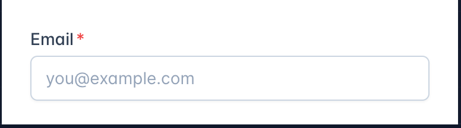

`Pseudo-classes` let us apply a chunk of CSS based on an element's current state.like `hover:,focus:,first:`etc

## focus

HTML comes with interactive elements like buttons, links, and form inputs. When we interact with one of these elements (either by clicking on it or tabbing to it), it becomes focused. It'll capture keyboard input, so we can type into a form field or press "Enter" to follow a link.

The `focus:`pseudo-class allows us to apply styles exclusively when an interactive element has focus:

## checked

The `checked:`pseudo-class only applies to checkboxes and radio buttons that are "filled in". You can apply additional styles to indicate that the input is activated

```html
<label>
  <input class="h-6 checked:w-8" type="checkbox" />
  Avocado
</label>
```

In tailwindCSS,These modifiers can even be **_stacked_** to target more specific situations, for example changing the background color in dark mode, at the medium breakpoint, on hover:

```html
<button class="dark:md:hover:bg-dark-200 ...">Save changes</button>
```

`Pseudo-elements`are like pseudo-classes, but they don't target a specific state. Instead, they target "sub-elements" within an element.

## Before and After

Style the `::before` and ` ::after` pseudo-elements using the before and after modifiers.

Save before and after for situations where it’s important that the content of the pseudo-element is not actually in the DOM and can’t be selected by the user.

```html
<label class="block">
  <span class="block after:ml-0.5 after:text-red-500 after:content-['*'] ">
    Email
  </span>
  <input type="email" name="email" class="..." placeholder="you@example.com" />
</label>
```



## Placeholder

If we stop and think about it, something pretty interesting is happening here. We haven't explicitly created a`<placeholder>` element, but by adding the placeholder attribute to the `<input>` tag, a pseudo-element is created.

This is why they're called pseudo-elements — these selectors target elements in the DOM that we haven't explicitly created with HTML tags.
